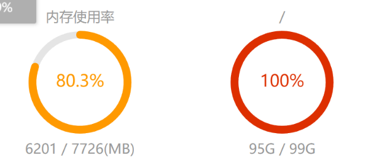

# linux存储问题打满

如图:



## 分析
使用df -Th 命令查看当前linux的磁盘情况

```
Filesystem     Type      Size  Used Avail Use% Mounted on
devtmpfs       devtmpfs  4.1G     0  4.1G   0% /dev
tmpfs          tmpfs     4.1G   41k  4.1G   1% /dev/shm
tmpfs          tmpfs     4.1G  1.4M  4.1G   1% /run
tmpfs          tmpfs     4.1G     0  4.1G   0% /sys/fs/cgroup
/dev/vda1      ext4      106G  102G     0 100% /
tmpfs          tmpfs     811M     0  811M   0% /run/user/0
overlay        overlay   106G  102G     0 100% /var/lib/docker/overlay2/c3eca2ef0d2a745880fe32231faa7ff3b2b9d5518ecc3916a71ad14d65436bd6/merged
overlay        overlay   106G  102G     0 100% /var/lib/docker/overlay2/bebef0c1c62a510b0d7209d3e144dfc3eb3f4435512c9f41f745745fa67ba449/merged
overlay        overlay   106G  102G     0 100% /var/lib/docker/overlay2/25fdbb2f2bfb3f51d46a031eba7cc75649b918c1ee38b7ef06dd84136f66d48f/merged
overlay        overlay   106G  102G     0 100% /var/lib/docker/overlay2/5d79c7d926cd2c432143d078d4656e36d53d1f55c91f6aa00bca031f7e9434fe/merged
overlay        overlay   106G  102G     0 100% /var/lib/docker/overlay2/eecd547d911eaf1117a20f60b71334d18ce37f4e865076c0b31556d50a1e1e94/merged
overlay        overlay   106G  102G     0 100% /var/lib/docker/overlay2/4f4d6ebcec0aa58e429b8fe9127f793e9f0723032d62fea5a5c37299ead9d3da/merged
overlay        overlay   106G  102G     0 100% /var/lib/docker/overlay2/5a870bbce66211b9356da6f75ac679114922e3f9965a864ed379a78ab9d75bdb/merged
overlay        overlay   106G  102G     0 100% /var/lib/docker/overlay2/6b66e08825ac8db22eacf8b26df5ad58b1513b28e9ae52b471cff02b426b9134/merged
overlay        overlay   106G  102G     0 100% /var/lib/docker/overlay2/20580225a78182c88ee95f825facb694c061549b73f4fe829768c4cef7ec205d/merged
overlay        overlay   106G  102G     0 100% /var/lib/docker/overlay2/bc2cf269e415b502fac1e14b93526001a8321799f9096819d2e9e47130c27c23/merged
```

发现/dev/vda1以及所有关于docker的overlay都已经打满

原因：
系统长时间没有比赛举行，所以硬盘也不应该直接打满，
而又没有对docker容器添加日志文件的定期清理，由于日积月累，
导致日志文件增加，打满了当前硬盘

解决方案：

1.手动清楚当前的日志文件( 治标 )
```
docker ps -aq | xargs docker inspect --format='{{.LogPath}}' | xargs truncate -s 0
```

2.配置下docker容器的日志大小（治本, 要重新部署容器）
```
sudo tee /etc/docker/daemon.json <<EOF
{
  "log-driver": "json-file",
  "log-opts": {
    "max-size": "10m",    # 单个日志文件最大10MB
    "max-file": "3"       # 最多保留3个日志文件
  }
}
EOF

# 重启 Docker 服务
sudo systemctl restart docker
```
