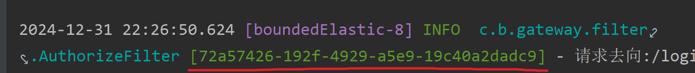
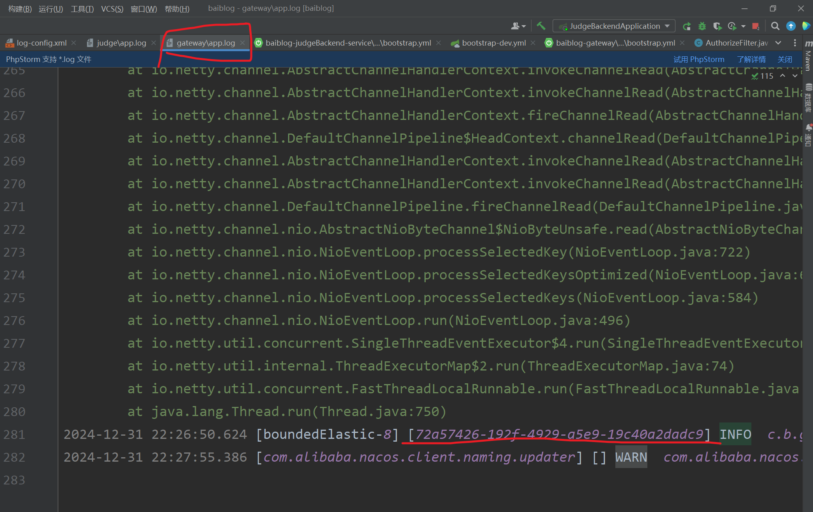

# 全链路日志文档

#### 前言：
在微服务项目中，对于一个服务调用另一个服务的问题排查，一直是一个痛点

#### 术语解释


#### 实现：
思路： 我们可以通过handler配合MDC日志上下文并配置log的配置文件，对其添加traceId进行实现全链路日志监控

具体实现：
1. 当引入了spring的start包，则我们只需要配置对应的log配置
``` yaml
logging:
   config: classpath:log-config.xml // 文件配置
```
2. 配置对应log的xml
- 放在当前目录位置

- 输入配置(我们MDC输入的值，在模板里可以通过%X{x-trace-id}这样的格式输出)
```xml
<?xml version="1.0" encoding="UTF-8"?>
<configuration>

    <!-- 定义颜色转换规则 -->
    <conversionRule conversionWord="clr" converterClass="org.springframework.boot.logging.logback.ColorConverter" />
    <conversionRule conversionWord="wex" converterClass="org.springframework.boot.logging.logback.WhitespaceThrowableProxyConverter" />
    <conversionRule conversionWord="wEx" converterClass="org.springframework.boot.logging.logback.ExtendedWhitespaceThrowableProxyConverter" />

    <!-- 控制台输出配置 -->
    <appender name="STDOUT" class="ch.qos.logback.core.ConsoleAppender">
        <encoder>
            <pattern>%clr(%d{yyyy-MM-dd HH:mm:ss.SSS}){faint} %clr([%thread]){magenta} %clr(%-5level) %clr(%logger{36}){cyan} %clr([%X{x-trace-id}]) - %msg%n%wEx</pattern>
        </encoder>
    </appender>

    <!-- 文件输出配置保持原来示例中的配置不变 -->
    <appender name="FILE" class="ch.qos.logback.core.rolling.RollingFileAppender">
        <file>logs/app.log</file>
        <rollingPolicy class="ch.qos.logback.core.rolling.TimeBasedRollingPolicy">
            <fileNamePattern>logs/app-%d{yyyy-MM-dd}.log</fileNamePattern>
            <maxHistory>30</maxHistory>
        </rollingPolicy>
        <encoder>
            <pattern>%d{yyyy-MM-dd HH:mm:ss.SSS} [%thread] [%X{x-trace-id}] %-5level %logger{36} - %msg%n</pattern>
        </encoder>
    </appender>

    <!-- 根日志记录器配置保持原来示例中的配置不变 -->
    <root level="INFO">
        <appender-ref ref="STDOUT"/>
        <appender-ref ref="FILE"/>
    </root>

    <!-- 针对具体包设置日志级别等保持原来示例中的配置不变 -->
    <logger name="com.example" level="DEBUG" additivity="false">
        <appender-ref ref="STDOUT"/>
        <appender-ref ref="FILE"/>
    </logger>

</configuration>
```
3. 若我们有对应的网关层(此处是SpringCloudGateway)，则在网关的filter中添加trace_id
```java
@Component
@Slf4j
public class MdcFilter implements GlobalFilter {
    @Override
    public Mono<Void> filter(ServerWebExchange exchange, GatewayFilterChain chain) {
        
        // 配置全链路traceId
        String traceId = UUID.fastUUID().toString();
        GatewayUtil.addHeader(request, Constants.TRACE_ID, traceId);
        MDC.put(Constants.TRACE_ID, traceId);
        
        return chain.filter(exchange);
    }
}
```
4. 在其他服务最上层抽出构建一个MdcHandler
```java
@Component
public class MdcHandler implements HandlerInterceptor {

    @Override
    public boolean preHandle(HttpServletRequest request, HttpServletResponse response, Object handler) throws Exception {
        // 配置全链路traceId
        String traceId = request.getHeader(Constants.TRACE_ID);
        // 若请求进来没有traceId，则赋值traceId
        if(traceId == null){
            traceId = UUID.fastUUID().toString();
        }
        MDC.put(Constants.TRACE_ID, traceId);
        return true;
    }

    @Override
    public void postHandle(HttpServletRequest request, HttpServletResponse response, Object handler, ModelAndView modelAndView) throws Exception {
        // 记得清楚
        MDC.clear();
    }
}
```
5. 配置handler
```java
@Component
public class MvcConfig implements WebMvcConfigurer {
    @Autowired
    private MdcHandler mdcHandler;
    @Override
    public void addInterceptors(InterceptorRegistry registry) {
        registry.addInterceptor(mdcHandler);
    }
}
```
6. 最终效果



#### 结语
这种是较为简单的处理方式，是将log存在了本地，可以通过文件打开，或者linux中tail/less等命令打开排查问题，
查询对应的微服务日志，但是这样也存在了一定的局限性

#### 拓展
其实我们可以去部署elk，进行实现快速的搜索日志traceId进行全日制监控